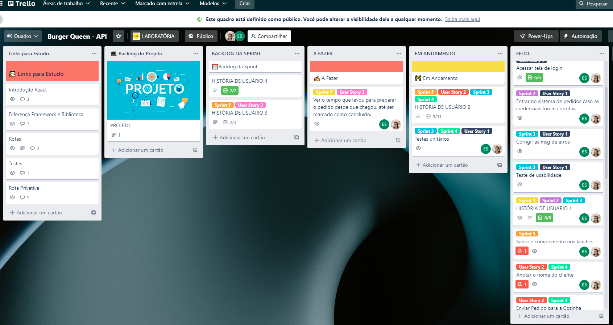
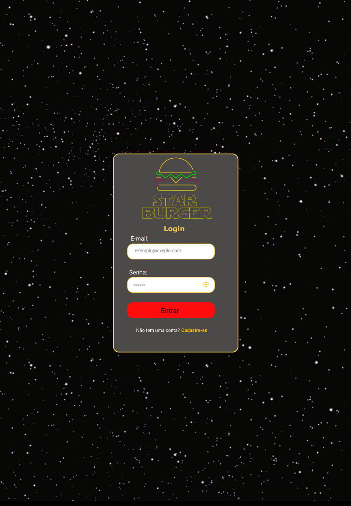
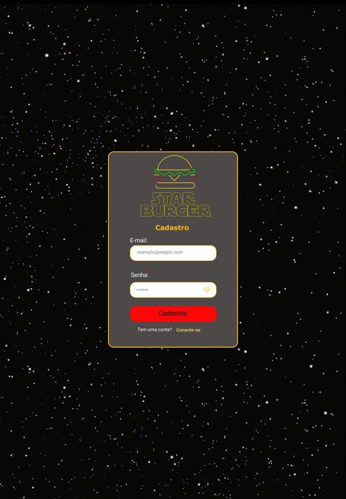

# Burger Queen (API Client) - Star Burger

## Índice

* [1. Introdução](#1-introdução)
* [2. Histórias de Usuários](#2-histórias-de-usuários)
* [3. Planejamento](#3-planejamento)
* [4. Considerações gerais](#4-considerações-gerais)
* [5. Desenvolvedoras](#6-desenvolvedoras)

***

## 1. Introdução

Star Burger é uma hamburgueria que está crescendo e lançou o serviço de 24 horas. Para facilitar o dia a dia dos funcionários, desenvolvemos uma aplicação que você pode conferir [AQUI](https://starburger.netlify.app/). 

## 2. Histórias de Usuários

#### [História de usuário 1] Garçom/Garçonete deve poder entrar no sistema

Eu, como garçom/garçonete quero entrar no sistema de pedidos.

 

#### [História de usuário 2] Garçom/Garçonete deve ser capaz de anotar o pedido do cliente

Eu como garçom/garçonete quero poder anotar o pedido de um cliente para não
depender da minha memória, saber quanto cobrar e poder enviar os pedidos para a
cozinha para serem preparados em ordem.

 

#### [História de usuário 3] Chefe de cozinha deve ver os pedidos

Eu como chefe de cozinha quero ver os pedidos dos clientes em ordem, poder
marcar que estão prontos e poder notificar os garçons/garçonetes que o pedido
está pronto para ser entregue ao cliente.

 

#### [História de usuário 4] Garçom/Garçonete deve ver os pedidos prontos para servir

Eu como garçom/garçonete quero ver os pedidos que estão prontos para entregá-los
rapidamente aos clientes.

 

## 3. Planejamento

Para entregar o MVP do projeto, organizamos o desenvolvimento da aplicação pelo método [Kanban](https://pt.wikipedia.org/wiki/Kanban), no Trello. Para cada história de usuários, separamos cards com as tarefas a serem realizadas à medida que avançávamos nas Sprints.

 

### Protótipo de Alta Fidelidade

O protótipo de alta fidelidade foi desenvolvido por meio de um editor gráfico de vetor e prototipagem de projetos, o Figma. 

## 4. Considerações Gerais

O projeto foi desenvolvido utilizando **React**. Alguns ajustes foram feitos pensando na usabilidade do usuário, como por exemplo, um scroll para os produtos na tela, como também para o resumo da compra. Inserimos botões de adicionar e remover produtos na comanda, para facilitar o trabalho do atendente.
Na cozinha, o botão para encerrar o pedido não precisa ser ativado a cada processo (como por exemplo, quando o pedido chega na cozinha e quando finalizado, porque subentende-se que ao chegar a cozinha, deve ser preparado.)

## 5. Desenvolvedoras

Este projeto foi desenvolvido durante o Bootcamp da Laboratória, turma SAP 007, pelas desenvolvedoras:

- [Elizenai Silva](https://www.linkedin.com/in/elizenai/)

- [Gabriela Medrado](https://www.linkedin.com/in/gabrielamedrado/)

<a href='#topo'>🚀 Voltar ao topo</a>
